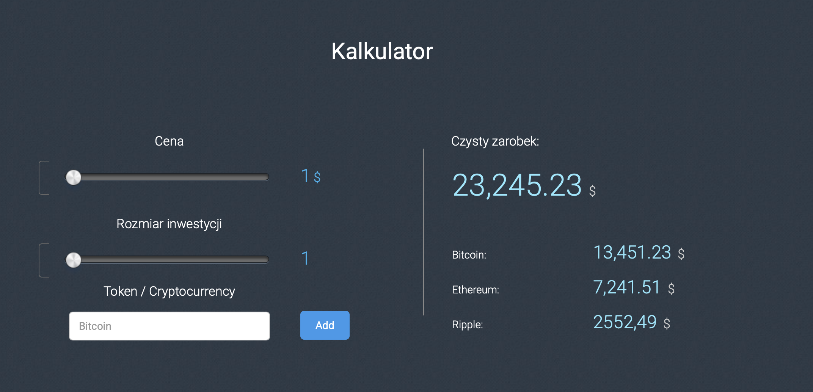
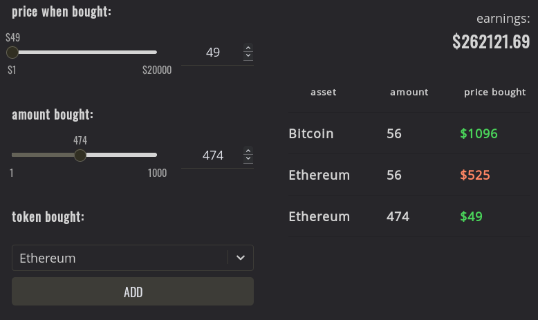

# `investment-calculator`

## Task

Based on mockup, come up with a solution. Use [CoinGecko API](https://www.coingecko.com/en/api#explore-api) and React.
Rest doesn't matter.

## Solution

### Main features
---
What's okay:

- colorized output in table shows whenever you lost or gained on investment
- changed color palette to a simpler one

### Possible improvements
---
What can be better:

- testing (no knowledge yet on React testing)
- fetching coin list from API
- better code on calculation the investment earnings (per investment, not sum)
